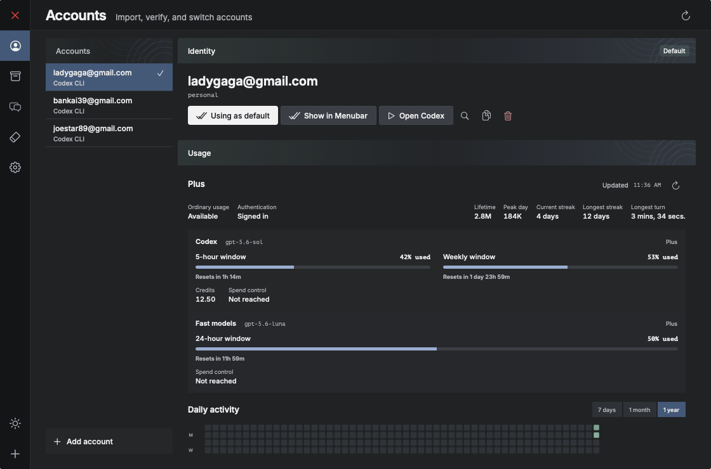
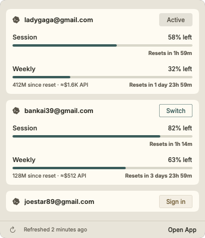
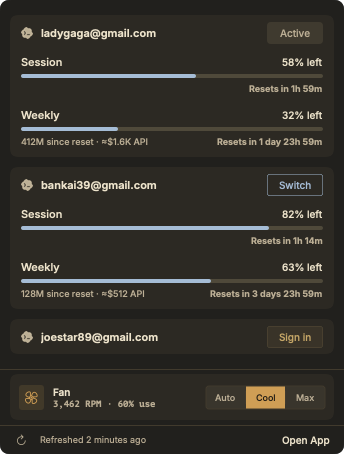
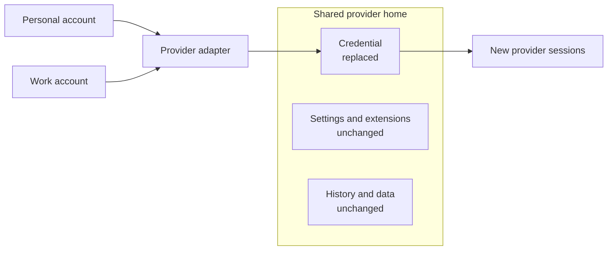

# Switch

**Switch AI accounts without signing in over and over.**

Switch is a native macOS account manager for supported AI coding tools. Keep
multiple logins ready, select an account from the menu bar, and open the right
tool without repeating its sign-in flow.



*Synthetic Preview data. The account names and usage values are examples.*

## Get Switch for Mac

[Download Switch for Mac](https://github.com/surajmandalcell/switch/releases/download/v3.1.3/Switch-v3.1.3-mac-arm64.zip),
unzip it, and move `Switch.app` to Applications. Switch requires macOS 14 or
later on Apple Silicon. Install the command-line tool for each provider you use.

| Provider | Account switching | Usage limits |
| --- | --- | --- |
| Codex CLI | Supported | Supported |
| [Grok Build](https://github.com/xai-org/grok-build#installing-the-released-binary) | Supported | Not exposed in Switch |
| Claude Code, Gemini CLI, Antigravity CLI | WIP | WIP |

You can also [build Switch from source](docs/development.md#build-and-check).

## Use Switch in the terminal

Open the terminal interface without a global install:

```bash
npx --yes @smdl/switch
```

Or install it globally:

```bash
npm install --global @smdl/switch
switch
```

The npm build currently supports Apple Silicon Macs. From a source checkout,
the direct path is:

```bash
make tui
```

The terminal interface uses the same account store and switching engine as the
Mac app. Use the arrow keys to move, Enter to select, and Escape to go back.
The existing `ai-manager` command remains available as an alias. Run
`switch help` for non-interactive commands and JSON output.

## Start switching

Choose **Add Account**, then select Codex CLI or Grok Build.

1. Sign in through the provider's isolated temporary home.
2. Return to Switch and choose **Check Now**.
3. Choose **Switch** in the menu bar, or **Set as Default** in the app.
4. Choose **Open** to launch that provider with the selected account.

Sign-in runs in a private temporary home. It does not replace your current
login while you add another account.

## See account status before you switch

The menu bar lists every saved account and the current default for each provider.
When a provider exposes usage data, Switch also shows its available limits and refreshes
them at launch and every three minutes. The status item can show up to four account
percentages, and the popover lists every account without inventing unavailable data.

| Light | Dark |
| :---: | :---: |
|  |  |

## Only the provider login changes

Switch keeps each provider's settings, extensions, and work history in its shared home.
Selecting an account changes only that provider's credential file. Each provider keeps
its own default account, and all providers use the same switching engine.



Provider notes:

- **Codex CLI:** Switch replaces only `~/.codex/auth.json`. Existing sessions keep the
  credential they already loaded. Usage limits, history, activity, imports, and Cleanup
  are available.
- **Grok Build:** Switch replaces only `~/.grok/auth.json`. The official CLI reloads that
  file before its next API call. Account switching is available; usage data is not exposed.

## More when you need it

- **Check a saved account.** Validate its credential without making it the default, and
  refresh usage when the provider exposes it.
- **Import an existing account.** Review a credential or provider home before adding it.
  Extra settings and history remain optional where supported.
- **Explore supported history.** Search conversations, track daily token activity, and
  retain summaries when the provider supplies compatible data.
- **Clean up safely.** Preview supported conversations and caches, move them to
  recoverable trash, and restore them when needed.

Codex CLI and Grok Build are enabled providers. Claude Code, Gemini CLI, and
Antigravity CLI appear as WIP choices in the Add Account catalog.

For sample accounts without real credentials, use the
[isolated Preview build](docs/development.md#preview-with-sample-accounts).
[Development and release notes](docs/development.md) cover packaging and
safety. The [product specification](docs/specs/product.md) defines current
behavior. Local ignored goal ledgers record current work and old verification.
