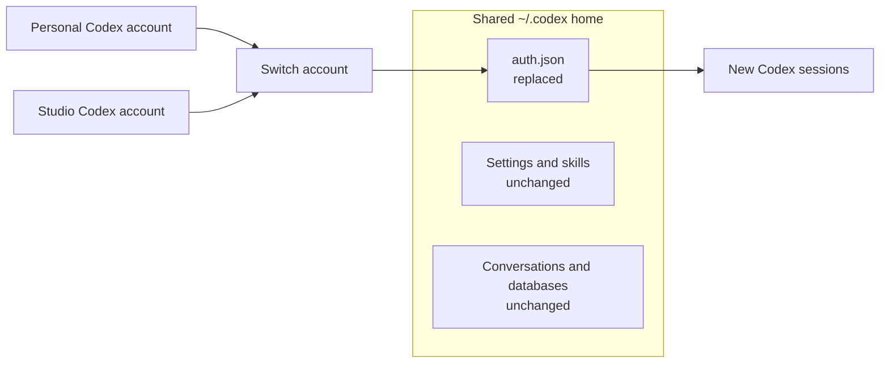

# Switch

**Switch Codex accounts without signing in over and over.**

Switch is a native macOS app that keeps your Codex logins ready. Check which
account has room, select it from the menu bar, and open Codex. Sessions that
are already running keep their current login.

*Synthetic Preview data. The account names and usage values are examples.*

## Get Switch for Mac

[Download Switch for Mac](https://github.com/surajmandalcell/switch/releases/download/v3.0.0/Switch-v3.0.0-mac-arm64.zip),
unzip it, and move `Switch.app` to Applications. Switch requires macOS 14 or
later on Apple Silicon and uses Codex CLI for account sign-in and launching Codex.

You can also [build Switch from source](docs/development.md#build-and-check).

## Start switching

Switch saves your current Codex login when you first open it.

1. Choose **Add Account** and sign in to another Codex account.
2. Return to Switch and choose **Check Now**.
3. Choose **Switch** in the menu bar, or **Set as Default** in the app.
4. Choose **Open Codex** to start a new session with that account.

Sign-in runs in a private temporary home. It does not replace your current
login while you add another account.

## See your limits before you switch

The menu bar shows remaining usage for the accounts you choose. Open its
popover to compare session and weekly limits, switch accounts, or refresh
usage. Its status item shows up to four account percentages; the popover lists
every saved account. You can set a default display preference.

| Light | Dark |
| :---: | :---: |
|  |  |

## Only the login changes

For Codex CLI, Switch keeps one shared `~/.codex` home. Selecting a saved
account atomically replaces its `auth.json` for new sessions. It leaves your
settings, skills, and conversations where they are.

Existing Codex sessions keep the credentials they already loaded.

## More when you need it

- **Check a saved account.** Validate its `auth.json` and refresh usage without making it the default.
- **Import an existing login.** Review an `auth.json` or Codex folder before adding it. Settings and chats are optional import scope.
- **Find a conversation.** Search shared chat history, filter message roles, and load older messages as you scroll.
- **Track activity.** Browse a daily calendar and retain token summaries after old conversations are removed.
- **Clean up safely.** Preview exact conversations and caches, move conversations to recoverable trash, and restore them when needed.

Codex CLI is the only enabled provider today. Claude Code, Gemini CLI, and
Antigravity CLI appear as WIP choices in the Add Account catalog.

For sample accounts without real credentials, use the
[isolated Preview build](docs/development.md#preview-with-sample-accounts).
[Development and release notes](docs/development.md) cover packaging and
safety. The [product specification](docs/specs/product.md) defines current
behavior; [goals.md](goals.md) records verification.
