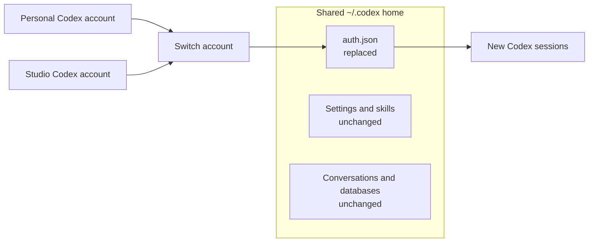

# Switch

**Switch AI accounts without signing in over and over.**

Switch is a native macOS account manager for supported AI coding tools. Keep
multiple logins ready, select an account from the menu bar, and open the right
tool without repeating its sign-in flow.


*Synthetic Preview data. The account names and usage values are examples.*

## Get Switch for Mac

[Download Switch for Mac](https://github.com/surajmandalcell/switch/releases/download/v3.1.1/Switch-v3.1.1-mac-arm64.zip),
unzip it, and move `Switch.app` to Applications. Switch requires macOS 14 or
later on Apple Silicon. Install the command-line tool for each provider you use.

| Provider | Account switching | Usage limits |
| --- | --- | --- |
| Codex CLI | Supported | Supported |
| [Grok Build](https://github.com/xai-org/grok-build#installing-the-released-binary) | Supported | Not exposed in Switch |
| Claude Code, Gemini CLI, Antigravity CLI | WIP | WIP |

You can also [build Switch from source](docs/development.md#build-and-check).

## Use Switch in the terminal

Open the terminal interface without a global install:

```bash
npx --yes @smdl/switch
```

Or install it globally:

```bash
npm install --global @smdl/switch
switch
```

The npm build currently supports Apple Silicon Macs. From a source checkout,
the direct path is:

```bash
make tui
```

The terminal interface uses the same account store and switching engine as the
Mac app. Use the arrow keys to move, Enter to select, and Escape to go back.
The existing `ai-manager` command remains available as an alias. Run
`switch help` for non-interactive commands and JSON output.

## Start switching

Choose **Add Account**, then select Codex CLI or Grok Build.

1. Sign in through the provider's isolated temporary home.
2. Return to Switch and choose **Check Now**.
3. Choose **Switch** in the menu bar, or **Set as Default** in the app.
4. Choose **Open** to launch that provider with the selected account.

Sign-in runs in a private temporary home. It does not replace your current
login while you add another account.

## See your limits before you switch

For Codex, the menu bar shows remaining usage for the accounts you choose. Open its
popover to compare session and weekly limits, switch accounts, or refresh
usage. Its status item shows up to four account percentages; the popover lists
every saved account. You can set a default display preference.

| Light | Dark |
| :---: | :---: |
|  |  |

## Only the provider login changes

For Codex CLI, Switch keeps one shared `~/.codex` home. Selecting a saved
account atomically replaces its `auth.json` for new sessions. It leaves your
settings, skills, and conversations where they are.



Existing Codex sessions keep the credentials they already loaded.

For Grok Build, Switch atomically replaces only `~/.grok/auth.json`. Grok's
configuration, rules, plugins, and sessions stay in `~/.grok`. The official
CLI hot-reloads a changed credential for its next API call, so an already
running Grok session may begin using the newly selected account.

## More when you need it

- **Check a saved account.** Validate its `auth.json` without making it the default; Codex checks also refresh usage.
- **Import an existing Codex login.** Review an `auth.json` or Codex folder before adding it. Settings and chats are optional import scope.
- **Explore Codex history.** Search shared conversations, track daily token activity, and retain summaries after old conversations are removed.
- **Clean up safely.** Preview exact Codex conversations and caches, move them to recoverable trash, and restore them when needed.

Codex CLI and Grok Build are enabled providers. Claude Code, Gemini CLI, and
Antigravity CLI appear as WIP choices in the Add Account catalog.

For sample accounts without real credentials, use the
[isolated Preview build](docs/development.md#preview-with-sample-accounts).
[Development and release notes](docs/development.md) cover packaging and
safety. The [product specification](docs/specs/product.md) defines current
behavior. Local ignored goal ledgers record current work and old verification.
