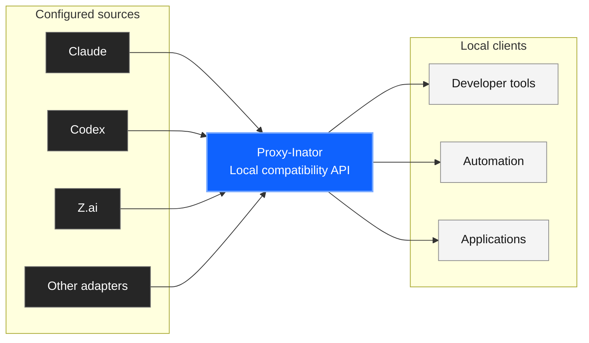
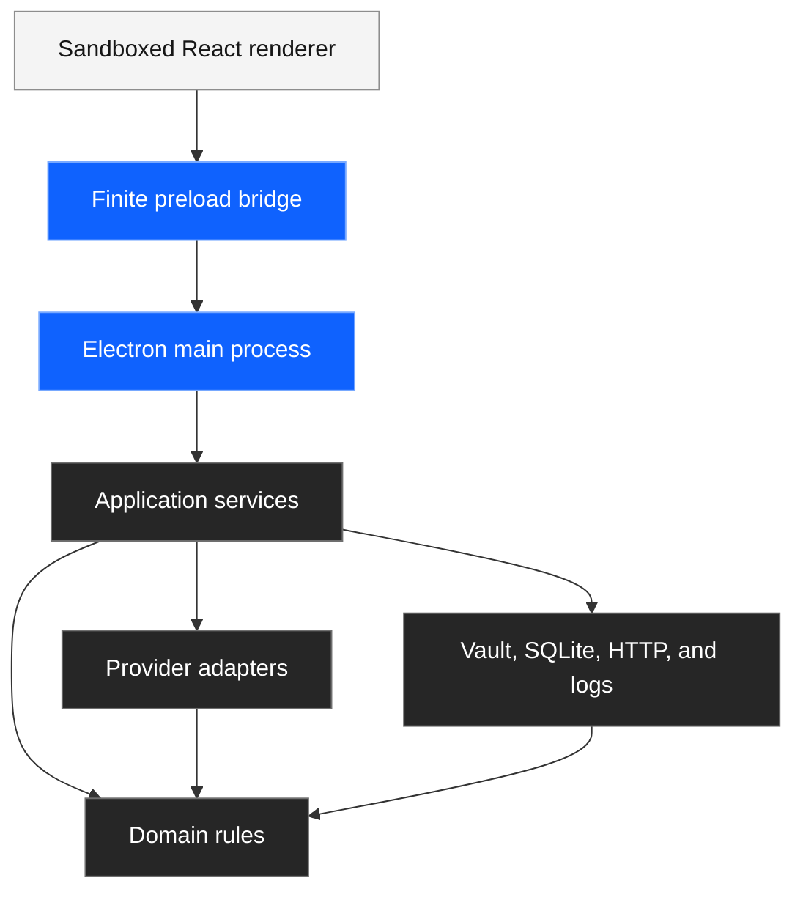
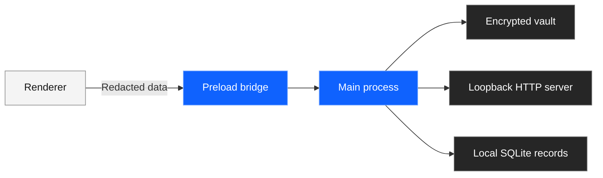

> **Current direction:** AI Manager is being narrowed to a native macOS Codex account switcher and importer.
> Read [goals.md](goals.md) for the implementation plan and acceptance gates.
> Native implementation is pending. The gateway documentation below describes the legacy application.

<p align="center">
  
</p>

<h1 align="center">Subscription Proxy Inator</h1>

<p align="center">
  A desktop gateway that gives local AI clients one compatible API.
</p>

<p align="center">
  <a href="https://github.com/surajmandalcell/subscription-proxy-inator/actions/workflows/desktop-ci.yml"></a>
  <a href="https://github.com/surajmandalcell/subscription-proxy-inator/actions/workflows/codeql.yml"></a>
  <a href="https://surajmandalcell.github.io/subscription-proxy-inator/"></a>
  <a href="CHANGELOG.md"></a>
  <a href="LICENSE"></a>
</p>

<p align="center">
  <strong><a href="https://surajmandalcell.github.io/subscription-proxy-inator/">Documentation</a></strong>
  · <strong><a href="docs/QUICK_START.md">Quick start</a></strong>
  · <strong><a href="docs/ARCHITECTURE.md">Architecture</a></strong>
  · <strong><a href="docs/SECURITY.md">Security</a></strong>
</p>

Subscription Proxy Inator connects configured providers and accounts. It selects an eligible route for each request.

The gateway can try another route before visible output starts. It stores usage and route-attempt records in local SQLite.

The application is for one local user. The HTTP server listens on loopback by default.

## System flow



## Main functions

| Area | Function |
| --- | --- |
| Providers | Add multiple accounts to each provider. |
| Routing | Use seven selection strategies and provider overrides. |
| Failover | Try another eligible route before visible output. |
| Protocols | Serve OpenAI-compatible and Anthropic-compatible routes. |
| Usage | Store token, cache, latency, cost, status, and attempt data. |
| Security | Encrypt credentials outside the sandboxed renderer. |
| Platforms | Use one renderer on Windows, macOS, and Linux. |

## Architecture



The domain layer has no Electron, database, network, provider, or renderer imports. Application services use ports supplied by the bootstrap layer.

## Install from source

Requirements:

- Node.js 22 or later
- npm 10.9 or later
- Build tools for Electron and `better-sqlite3`

```bash
git clone https://github.com/surajmandalcell/subscription-proxy-inator.git
cd subscription-proxy-inator
npm ci
npm run check
npm run dev
```

The default local address is `http://127.0.0.1:8081`.

## Configure the gateway

1. Open **Providers**.
2. Add a provider adapter.
3. Add one or more accounts.
4. Save the account credentials.
5. Open **Routing**.
6. Select a global strategy.
7. Add provider overrides when necessary.
8. Open **Models and pricing**.
9. Add aliases or verified prices when necessary.
10. Connect a compatible client.

The main process encrypts credentials when it saves them.

OpenAI-compatible environment:

```bash
export OPENAI_BASE_URL=http://127.0.0.1:8081/v1
export OPENAI_API_KEY=local-proxy-key
```

Anthropic-compatible environment:

```bash
export ANTHROPIC_BASE_URL=http://127.0.0.1:8081
export ANTHROPIC_API_KEY=local-proxy-key
```

The local key is optional until you enable it in **Settings**. It is not a provider credential.

## Local routes

| Method | Path | Function |
| --- | --- | --- |
| `GET` | `/health` | Show local process health. |
| `GET` | `/v1/models` | List aliases and exact model IDs. |
| `POST` | `/v1/chat/completions` | Serve OpenAI Chat Completions. |
| `POST` | `/v1/responses` | Serve OpenAI Responses. |
| `POST` | `/v1/messages` | Serve Anthropic Messages. |
| `POST` | `/v1/messages/count_tokens` | Estimate local input tokens. |

Read [Local compatibility API](docs/API.md) for field support and limits.

## Security boundaries



- The renderer uses context isolation and sandboxing.
- The renderer has no Node.js integration.
- The preload bridge exposes a finite capability set.
- The server rejects non-loopback hosts.
- CORS uses exact configured origins.
- Logs remove credential fields and bearer values.

Read [Security model](docs/SECURITY.md) before you connect local automation.

## Quality gates

```bash
npm test                 # Run all Node.js tests
npm run test:coverage    # Run coverage gates
npm run verify           # Check the repository and architecture
npm run check:ste        # Check the ASD-STE100 project profile
npm run check:links      # Check source documentation links
npm run build:renderer   # Build the React renderer
npm run build:site       # Build the website and documentation
npm run dist:dir         # Build an unpacked desktop application
npm run build            # Run all checks and web builds
```

Routine GitHub checks start only after a push to `master`. Pull requests do not start project workflows.

Desktop CI validates the source and builds unpacked applications on Windows, macOS, and Linux. CodeQL analyzes JavaScript after each `master` update.

## Release status

| Area | Status |
| --- | --- |
| Source validation | Automated |
| Test and coverage gates | Automated |
| Production dependency audit | Automated |
| Windows, macOS, and Linux package builds | Automated |
| Checksums for tagged releases | Automated |
| Apple signing and notarization | Maintainer credentials required |
| Windows Authenticode signing | Maintainer credentials required |

The source is ready for validated release candidates. Public end-user packages still require platform signing and installation tests.

## Project map

```text
src/domain          Configuration, protocol, routing, and usage rules
src/application     Use cases and coordination services
src/providers       Provider protocol adapters
src/infrastructure  Storage, vault, HTTP server, and logs
desktop/main        Electron composition and validated IPC handlers
desktop/preload     Context-isolated renderer bridge
desktop/renderer    Responsive desktop interface
website             Public website source
docs                Product and maintainer documentation
```

## Documentation

- [Documentation index](docs/INDEX.md)
- [Quick start](docs/QUICK_START.md)
- [Architecture](docs/ARCHITECTURE.md)
- [Configuration](docs/CONFIGURATION.md)
- [Providers](docs/PROVIDERS.md)
- [Routing and failover](docs/ROUTING.md)
- [Usage and pricing](docs/USAGE.md)
- [Security model](docs/SECURITY.md)
- [Interface design system](docs/DESIGN_SYSTEM.md)
- [Development workflow](docs/DEVELOPMENT.md)
- [Release process](docs/RELEASE.md)
- [Contributing](CONTRIBUTING.md)

## Responsible use

Use only accounts and APIs that you have permission to use. The project does not get credentials or browser sessions.

The project does not resell subscriptions. It does not bypass provider limits. Local account switching does not change provider terms.

## License

The project uses the MIT License. Read [LICENSE](LICENSE).
